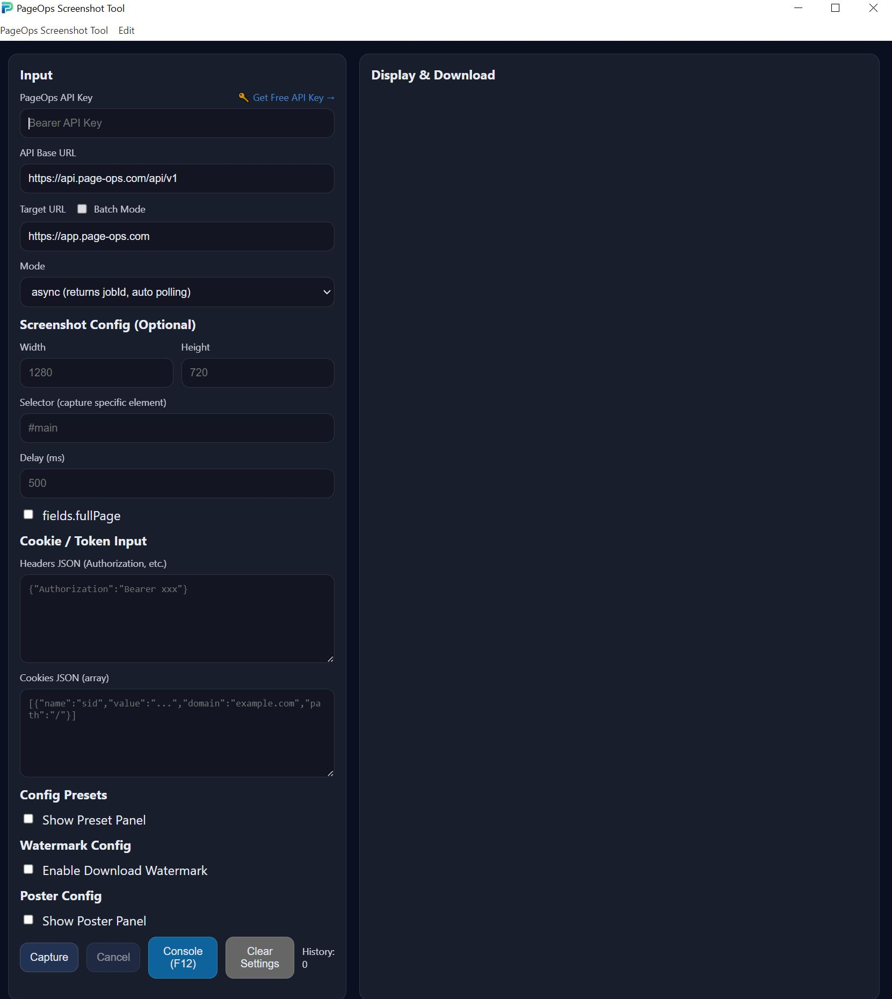

# PageOps Screenshot Tool

A free desktop app for capturing high-quality web screenshots — perfect for e-commerce monitoring, competitor analysis, automated reporting, and content archiving.

Powered by the [PageOps Screenshot API](https://app.page-ops.com).

---

## Download

| Platform | Installer | Portable |
|----------|-----------|----------|
| Windows  | [Download Setup .exe](../../releases/latest) | [Download Portable .exe](../../releases/latest) |
| macOS    | [Download .dmg](../../releases/latest) | — |

> **Free to use** — [Get your free API key](https://app.page-ops.com) to get started.

---

## Use Cases

- **E-commerce** — Capture product pages, pricing, promotions across multiple stores
- **Competitor monitoring** — Schedule screenshots of competitor websites
- **Automated reporting** — Generate visual reports from web dashboards
- **Content archiving** — Archive web pages as images for compliance or records
- **QA & Testing** — Capture pages at specific viewports for visual regression

---

## Quick Start

1. **Get a free API key** at [app.page-ops.com](https://app.page-ops.com)
2. **Download** and install the app (see Download section above)
3. **Enter your API key** in the API Key field
4. **Enter a URL** and click **Capture**
5. **Download** the screenshot as PNG or JPEG

---

## Screenshots

### Main Interface


### Generated Screenshot


### Social Media Posters

**Instagram Post (1080×1350)**


**Instagram Story (1080×1920)**


**Twitter/X Post**


---

## Features

- **Single & Batch capture** — Capture one URL or up to 20 URLs at once
- **Custom viewport** — Set width/height to simulate any device
- **Full-page screenshots** — Capture the entire page, not just the visible area
- **Element selector** — Capture a specific element using a CSS selector
- **Delay** — Wait for dynamic content to load before capturing
- **Custom headers & cookies** — Access authenticated or geo-restricted pages
- **Watermark** — Add text or image watermarks to screenshots
- **Poster generation** — Generate shareable poster images from screenshots
- **Presets** — Save and reuse your capture configurations
- **Network console** — Inspect API requests and responses in real time
- **Local history** — Browse all screenshots captured in the current session

---

## Capturing Authenticated Pages

To capture pages that require login, you can pass cookies from your browser.

### Method 1 — Browser Console (Recommended)

1. Open the target website in Chrome/Edge
2. Press `F12` → **Console** tab
3. Paste and run:
   ```js
   document.cookie.split(';').map(c => c.trim()).join('\n')
   ```
4. Copy the output and paste it into the **Cookies** field in the app

### Method 2 — Network Tab

1. Press `F12` → **Network** tab
2. Refresh the page
3. Click any request → **Headers** → find the `Cookie` header
4. Copy the value

### Cookie JSON Format

```json
[
  { "name": "session", "value": "abc123", "domain": "example.com", "path": "/" }
]
```

### Headers JSON Format

```json
{ "Authorization": "Bearer your-token-here" }
```

---

## Pricing

This desktop app is **free to use**. You only need a PageOps API subscription to power the screenshot engine.

| Plan | Screenshots | Price |
|------|-------------|-------|
| Free | 100 / month | $0 |
| Pro  | 10,000 / month | See [pricing](https://app.page-ops.com/en-US/pricing) |
| Business | Unlimited | See [pricing](https://app.page-ops.com/en-US/pricing) |

---

## Developer Setup

```bash
# Install dependencies
npm install

# Start in development mode
npm run dev

# Build production installers
npm run dist:win    # Windows
npm run dist:mac    # macOS
```

### Tech Stack

- [Electron](https://electronjs.org) — Desktop app framework
- [React](https://react.dev) — UI
- [TypeScript](https://typescriptlang.org) — Type safety
- [PageOps API](https://app.page-ops.com) — Screenshot engine

---

## License

MIT — free to use, modify, and distribute.